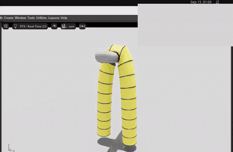
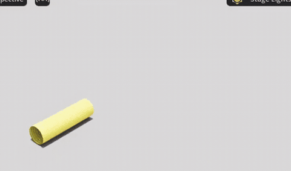
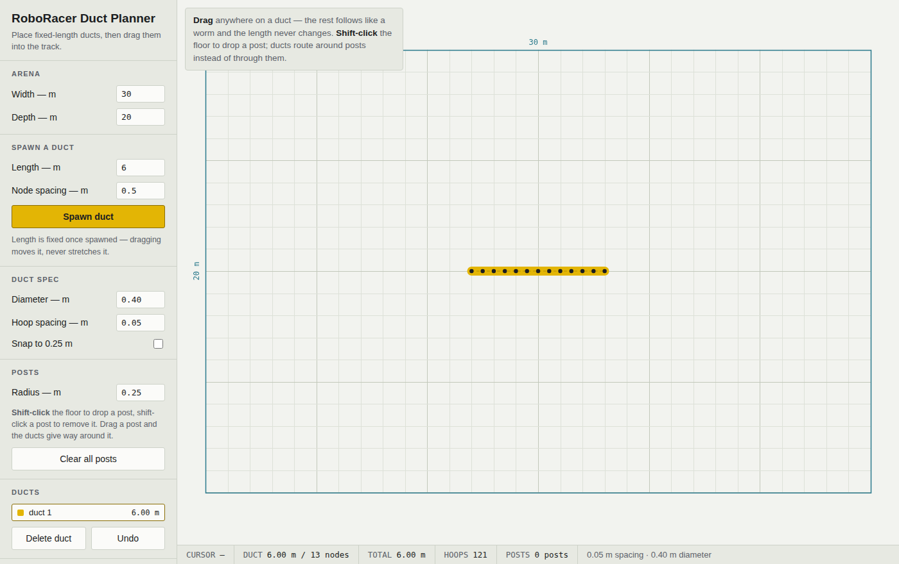
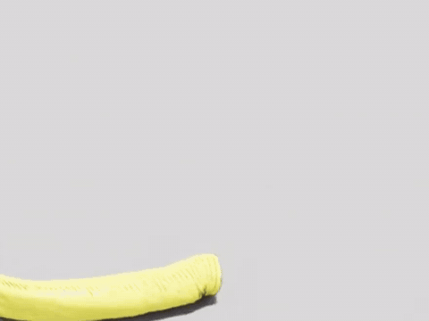

# flexible_duct_isaac

A flexible ventilation duct in **Isaac Sim 6.1** — rigid hoops every few
centimetres inside one continuous fabric sleeve — built as the soft barrier for
a RoboRacer track.

<p align="center">
  
  
</p>

Left: 20 hoops, 19 fabric spans, 38 seams — draped over a bar and held by the
fabric alone, since nothing joins the hoops to each other. Right: the same duct
bending under a sideways pull.

---

## Draw a track, build it, keep it

**1 — lay it out.** Open `tools/track_planner.html` in a browser. No install, no
network. Spawn ducts at a fixed length, drag them like a worm, drop posts they
have to route around.

<p align="center">
  
</p>

**2 — build it.** Save `track.json`, then:

```bash
conda activate hmclab6
python scripts/duct_build_gui.py --layout track.json \
    --ring-thickness 0.002 --ring-density 7800 --clearance -0.004 --rib-visual
```

A drawn curve comes out as a duct that follows it — the polyline is resampled at
the hoop spacing and every hoop is turned to face along the path.

<p align="center">
  
</p>

**3 — place and keep it.** `SHIFT + drag` a hoop to nudge it, `R` to bake the
bend so it stops springing back, `S` to save the arranged layout as USD.

---

## How it is built

| part | what it is | why |
|---|---|---|
| hoop collider | 32+ capsules around a circle | PhysX rigid shapes must be **convex**; a torus collider needs decomposition, ragged on a thin hoop and it jitters |
| hoop visual | a real torus (`--rib-visual`) | convexity constrains the *collider* only — drawing the visual separately makes a hoop read as a rib, not a fat tube |
| fabric | one continuous PhysX surface deformable | one sleeve per gap left a seam at every hoop that could open |
| seam | per-vertex constraints into the hoop's frame | not a weld of surfaces: each captured vertex is held at a stored **position** |

### The fabric goes clear of the hoops, never on them

The single most important detail. A seam binds cloth vertices *inside* the
hoop's collider — but "inside a collider" is exactly what the solver treats as
penetration, so on play it pushes those same vertices back out. Symptom: **no
gap while stopped, a gap the instant you press play.**

Offsetting the fabric removes the contradiction instead of suppressing it. The
seam still binds, because `deformableVertexOverlapOffset` attaches vertices that
are merely *near* the collider. Real ducting is built this way too.

```
--clearance  0.004   fabric outside, hoops hidden within it
--clearance -0.004   fabric inside,  hoops visible as outer ribs
```

### Collision filtering must match the seam — not exceed it

`create_auto_deformable_attachment` writes only its two relationships and leaves
everything else at defaults, two of which are wrong here
(`collisionFilteringOffset` = `-inf`, `deformableVertexOverlapOffset` = `0`).
Measured across the range:

| filtering | welded vertices | free fabric | result |
|---|---|---|---|
| `-inf` (stock) | collide | collide | hoop shoves off the fabric it holds → **gap** |
| far wider than the seam | filtered | filtered | hoop travels out through the skin → **pokes through** |
| off entirely | collide | collide | weld fights contact → **collapses** |
| **= the capture band** | filtered | collide | holds |

---

## Things that cost real time

**GPU results never return to USD.** Simulated state lives in Fabric —
`GetPointsAttr().Get()` reported `0.000000 m` of movement while the cloth had
fallen 1.0 m. So exporting an arranged track silently saved the *straight* duct.
`freeze.py` reads cloth points via `usdrt` and rigid poses straight from PhysX
(Fabric had the cloth but **not** the transforms).

**The built-in mouse grab cannot work here.** It calls `addForce`, illegal under
`eENABLE_DIRECT_GPU_API` — which cloth forces on by requiring CUDA. Enabling
`omni.physx.ui` makes it fire and error until the window dies. `mouse_drag.py`
rebuilds the gesture on `RigidPrim.apply_forces`.

**A `RigidPrim` built before physics warm-up poisons every later read** — it
reports authored poses forever, while the recording plainly shows motion.

**Hoops cannot be thinned freely.** The collider is a chain of capsules whose
axes are *chords*, so mid-chord it sits one sagitta `R(1-cos(π/n))` inside the
circle the cloth lies on. Too thin and the seams bind nothing *and still return
`True`*. The builder raises the segment count automatically.

**Starting state matters, three times over.** Filtering off from t=0 collapses
the duct but toggling to it later is fine; same for self-collision; and a duct
spawned resting exactly on the floor crumples, because step one must resolve
ground contact on every vertex at once.

**There is no plasticity parameter.** "Stays where I bent it" means moving the
target, not the material: `plastic.py` rewrites `restShapePoints` and
`restBendAngles`, then stop/plays so PhysX re-cooks.

---

## Measurements

Ø0.4 m duct, 0.05 m hoop spacing, 2 mm hoop tube, RTX 4080 SUPER.

Mesh resolution is nearly free — the GPU sits at ~24 %, so more work fits in the
same time:

| `--n-circ` | cloth vertices | ms/step |
|---|---|---|
| 28 | 1,708 | 5.0 |
| 56 | 3,416 | 5.3 |
| 84 | 7,644 | 4.5 |

Under identical force the finer mesh bends far more (0.012 → 0.257 m): a coarse
mesh has nowhere to fold, so it is artificially stiff. Single measurement.

The cloth is almost free; Isaac is not — 38 sleeves versus 1 cost **2 MiB** and
+11 % step time, against 7.2 GB resident for the renderer and framework.

---

## Layout

```
duct_sim/    spec · geometry · builder · layout · freeze · plastic · mouse_drag
scripts/     duct_build_gui.py (the tool) · record_gui.sh · test_*.py
tools/       track_planner.html
```

## Open

- No distance constraint between hoops, so the duct still stretches: at
  `--stretch 5000` a 2.30 m duct measured 3.09 m (+34 %). Nothing but fabric
  sets hoop spacing, and fabric resists tension but cannot push.
- Whether a LiDAR sees the *simulated* duct or the authored one is unverified.
  `test_lidar_sees_bend.py` is written but unrun; the sensor depends on
  `omni.hydra.rtx`, so it probably does — an inference, not a result.
- The full 30×20 m track (1000+ hoops) has not been built yet.
